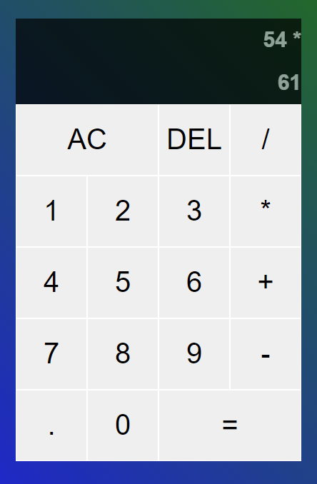

# [Javascript Calculator app](https://js-calculator-app.herokuapp.com/)

This Calculator app was created using Javascript.

## Functionalities
- Able to add, subtract, multiply, divide
- An 'AC' button to clear all inputs
- A 'DEL' button to backspace one number
- Clicking on an operator when both inputs have values will calculate the value and ask for the next input
- Clicking on an operator when asking for the next input will change the current operator
